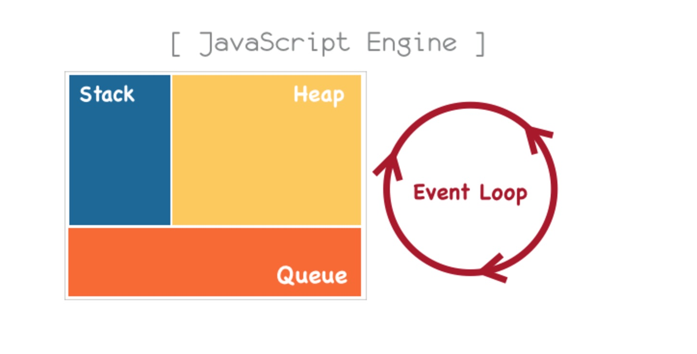
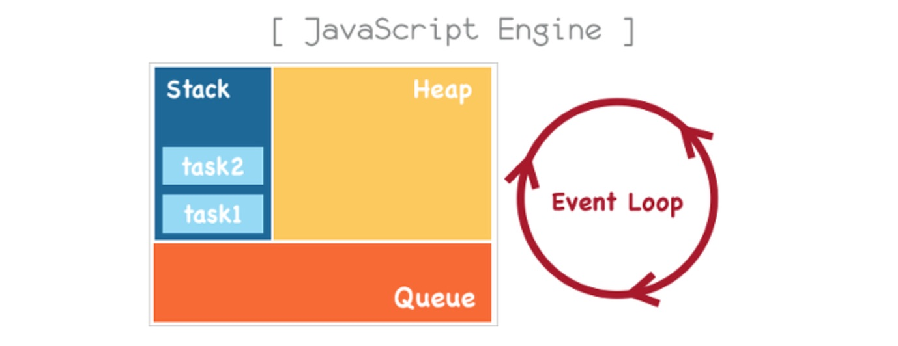

## JavaScript Introduction
### 특징
- HTML, CSS와 함께 웹을 구성하는 요소중 하나로 웹브라우저에서 동작하는 유일한 언어이다. 컴파일X
- 멀티-패러다임 언어로 명령형 (imperative), 함수형 (functional), 프로토타입 기반 (prototype-based) 객체지향형 언어다
- Javascript는 C-family languag로 C, Java에서 많은 문법을 차용했으며 Awk, Perl, Python으로부터도 영향을 받았고, Interpreter language이기 때문에 compile이 필요없어 HTML파일 안에 직접 기술이 가능하다.
- 구글의 Chrome V8 JavaScript 엔진으로 빌드된 JavaScript 런타임 환경(Runtime Environment)인 Node.js의 등장으로 JavaScript는 웹 브라우저를 벗어나 서버 사이드 어플리케이션 개발에서도 사용되는 Full stack 개발 언어가 되었다. 

### 동작원리
대부분의 프로그래밍 언어는 `운영체제` 위에서 실행된다. 
그와는 다르게 Javascript는 `브라우저` 틀안에서 HTML, CSS와 함께 실행된다. 
운영체제위에서 코딩하는 것보다는 훨신 효율적 프로그래밍이 가능하다.
브라우저의 주요 기능은 웹페이지를 서버에 요청하고 응답을 받아 브라우저에 표시하는것이다.
브라우저는 서버로부터 html, css, javascript 파일을 응답받는다. 
html, css 파일은 렌더링 엔진의 `HTML파서`와 `CSS파서`에 의해 파싱되어 DOM, CSSOM 트리로 변환되고 렌더 트리로 결합
HTML 파서는 script 태그를 만나면 DOM생성 프로세스를 중지하고 자바스크립트 엔진에 제어권한을 넘긴다. 
`자바스크립트의 위치`에따라 DOM 생성이 지연될 수 있음에 주의

### 관련링크 
- 브라우저동작원리 : http://d2.naver.com/helloworld/59361
- WebKit 구동원리 : http://rtcc.hanyang.ac.kr/sitedata/2015_2_ISP/howbrowserswork_20150915.pdf

### 기초문법
#### 1.자료형
#### 기본 자료형 (Primitive values)
오브젝트를 제외한 변경 불가능한값 (immutable value)
- Boolean : true 와 false 의 두 가지 값을 가질 수 있다.
- Null : Null 타입은 딱 한 가지 값, null 을 가질 수 있다.
- Undefined : 값을 할당하지 않은 변수는 undefined 값을 가진다. 
- Number
- String
- Symbol (ECMAScript 6에 추가) : Symbol은 유일하고 변경 불가능한 (immutable) 기본값 (primitive value) 이다
```js
typeof true; //"boolean"
typeof Boolean(true); //"boolean"
typeof new Boolean(true); //"object"
typeof (new Boolean(true)).valueOf(); //"boolean"
 
typeof "abc"; //"string"
typeof String("abc"); //"string"
typeof new String("abc"); //"object"
typeof (new String("abc")).valueOf(); //"string"
 
typeof 123; //"number"
typeof Number(123); //"number"
typeof new Number(123); //"object"
typeof (new Number(123)).valueOf(); //"number"
```

Javascript는 변수의 타입을 미리 선언할 필요가 없다. 타입은 프로그램이 처리되는 과정에서 자동으로 파악될 것이다
```js
var foo = 42;    // foo 는 이제 Number 
var foo = "bar"; // foo 는 이제 String 
var foo = true;  // foo 는 이제 Boolean 
    
ex) Java          
public string name = "go";
private int age = 25;
```
#### Object (객체형, 참조형)
객체는 데이터와 그 데이터에 관련되는 동작(절차,방법,기능)을 모두 포함할 수 있는 개념적 존재이다.
- 기본자료형(Primitives)을 제외한 나머지 값들(배열, 함수, 정규표현식 등)은 모두 객체이다.
- 함수 (Function), 배열 (Array), 날짜 (Date), 정규식 (RegExp)

#### 2.변수(Variable)
변수는 위치(주소)를 기억하는 저장소이다. 위치란 메모리 상의 주소(address)를 의미한다  
- 변수란 메모리 주소(Memory address)에 접근하기 위해 사람이 이해할 수 있는 언어로 지정한 식별자(identifier)이다.
- 변수를 선언하자마자 값을 대입하는 것을 초기화한다고 표현
- camelCase를 사용
```js
var a = ''; // 문자열
var b = 0; // 숫자
var c = false; // 불린
var d = null; // 널
var e = undefined; // 언디파인드
var f = []; // 배열
var g = {}; // 객체
var h = function() {}; // 함수
```
#### 3.연산자 (Operator)
참고 : https://msdn.microsoft.com/ko-kr/library/ce57k8d5(v=vs.94).aspx 
```js
// += -= 연산자 num = num + 5 와같다.
var num = 5;
console.log('+=연산자 num+=5', num+=5); // +=연산자 num+=5 10
console.log('-=연산자 num-=5', num-=5); // -=연산자 num-=5 5
// && and연산자 모두 참이어야한다.
var tmp = true;
var tmp2 = false;
// || or연산자 하나라도 참이면 실행
tmp || tmp2 ? console.log('or 하나라도 참') :console.log('or 모두 거짓이다.'); // or 하나라도 참
// 삼항연산자 (조건 ? 참 : 거짓)
tmp && tmp2 ? console.log('and 모두참') : console.log('and 거짓이 섞여있다.'); // and 거짓이 섞여있다.
// -- 감소연산자 나중에 반복문에서 다시살펴보겠습니다.
var tmp3 = 5;
--tmp3 // a를 감소하고 시작 
tmp3++ // 연산후 a를 증가
// > , < , >= , <= 대소 비교
console.log('3 > 5', 3 > 5); // 3 > 5 false
console.log('3 < 5', 3 < 5); // 3 < 5 true
console.log('3 >= 5', 3 >= 5); // 3 >= 5 false
console.log('3 <= 5', 3 <= 5); // 3 >= 5 false

// 비교  == , === , != , !== 
console.log('5' == 5); // true 값만 비교
console.log('5' === 5); // false 타입까지 체크를해서 비교 되도록이면 === 을 사용하자
console.log('5' != 3); // true
console.log('5' !== 3); // true
// typeof 타입체크
console.log(typeof 5); // number
console.log(typeof 5 === 'number'); // true
```
### 4.Javascript 환경
#### Javascript Engine 종류
크게 2 가지 종류 : Rendering, Javascript 엔진
Rendering Engine     
HTML CSS로 작성된 마크업을 rendering해주는 역할 
Javascript Engine     
Javascript를 해석하고 실행하는 인터프리터. 주로 웹브라우저에서 이용되지만 최근 Node.js가 등장하면서 server side에선 V8 Engine을 이용

#### 자바스크립트 엔진의영역
Call Stack, Task Queue(Event queue), Heap, EventLoop (Task queue에 들어가는 task관리)


#### Call Stack
자바스크립트는 단 하나의 호출 스택을 사용한다.      
하나의 함수가 실행되면 이 함수의 실행이 끝날때까지 어떤 task도 수행될수없다 (Run to Completion)        
요청이 들어올때마다 요청을 순차적으로 호출 스택에 담아서 처리한다.    
메서드가 실행될때 Call Stack에 새로운 프레임이 push되고 실행이 끝나면 해당프레임이 pop되는 원리    

```js
function first(x){
    var num = x;
    var num2 = second(num);
    return num + num2;
}
function second(y){
    var num = y;
    return num;
}
first(3);
```
`first`라는 함수를 호출 `first`에 해당하는 스택 프레임 형성, `first`안에는 `num`과 같은 local variable과 arguments가 함께 형성.     
`first`에서 `second`를 호출하고있다. `first`가 아직 종료되지않았으니 pop하지않고 `second`를 호출스택에 push한다.      
`second`함수가 역할을 마치면 호출스택에서 pop하고 `first`를 pop한다.     
`stack`이라는 자료구조의 특성을 사용하여 task들을 수행하는 원리


#### Heap
동적으로 생성된 객체(인스턴스)는 힙(Heap)에 할당된다. 대부분 구조화되지 않는 ‘더미’같은 메모리 영역을 `heap`라고 부른다.

#### Task Queue (Event Queue)
자바스크립트의 런타임환경에서는 처리해야 하는 Task들을 임시 저장하는 대기 큐가 존재한다.     
그 대기 큐를 Task Queue or Event Queue라고 한다.       
Call Stack이 비어졌을 떄 먼저 대기열에 들어온 순서대로 수행       
```js
setTimeout(function(){
    console.log(‘라이언’);
},0);
console.log(‘어피치’);
//누가 먼저 실행될까?
```
자바스크립트에서 비동기로 호출되는 함수들은 Call Stack에 쌓이지않고 Task Queue에 더해진다.       
자바스크립트에서는 이벤트에 의해 실행되는 함수들이 비동기로 실행된다.       
자바스크립트 엔진이 아닌 Web API영역에 따로 정의되어 있는 함수들은 비동기로 실행된다.      
```js
function first(){
    console.log(‘first’);
    second();
}
function second(){
    setTimeout(function(){
        console.log(‘second’);
    },0);
    third();
}
function third(){
    console.log(‘third’);
}
```
일단 ‘first’는 실행될것이다. ‘First’에서 ‘Second’를 호출하면 ‘setTimeout’함수가 실행되면서 Call Stack에 들어가자 마자 바로 빠져나온다.      
내부에 걸려있던 핸들러(익명함수)는 콜스택에 들어가서 바로 실행되지않는다. 이 핸들러는 call stack이 아니라 event queue영역으로 들어간다.       
그후 ‘third’함수가 call stack으로 들어간다.       
Stack -> ‘first’,’Second’,’third’ 동작이 다 끝나면 event queue -> ‘setTimeout’ 가 Call stack에 들어가서 실행된다. 이벤트에 걸려있는 핸들러는 절대 먼저 실행될 수 없다.   

