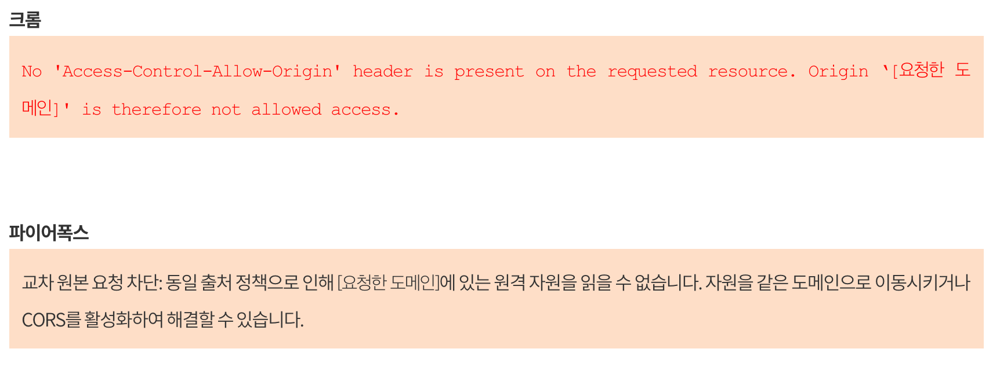

## Ajax (Asynchronous JavaScript and XML)

### XMLHttpRequest
클라이언트에서 서버 방향으로의 비동기 통신은 XHR(XMLHttpRequest)의 등장으로 실현됐습니다.   
정확하게는 그 이전부터 iframe이나 img 등을 써서 억지로 비동기 통신을 구현하는 방법은 있었지만 XMLHttpRequest 가 표준 통신 방법으로 지위를 확립함으로써 웹 애플리케이션의 비동기 통신 관련 기술이 비약적으로 발전했습니다.  
하지만 XHR에는 크로스 오리진 통신이 불가능하다는 큰 문제가 있습니다.

### Json 
Ajax 요청에 대한 서버의 응답은 주로 HTML, XML, JSON이 사용된다. 이 중 가장 일반적인 데이터 형식은 JSON(JavaScript Object Notation)입니다.
```text
{
  "Cat": "친칠라",
  "age": 999
}
```
                                                                  
### 오리진(origin)이란?
`스키마, 호스트명, 포트 번호`의 조합으로 표현되는 식별자를 말합니다.
웹 스토리지에 보존되는 데이터는 `동일` 오리진으로 동작하는 프로그램에서만 공유됩니다. 다른 오리진에서 동작하는 프로그램에서는 웹 스토리지를 참조할 수 없습니다.
이처럼 동일 오리진의 경우에만 접근을 허가하는 것을 `동일출처정책`(Same Origin Policy)이라고 합니다.     
또한 반대로 어떻게 해서 다른 오리진 간의 접근을 안전하게 할 것인가에 초점을 둔 크로스 오리진 자원 공유(CORS, Cross-Origin Resource Sharing)이라는 용어도 있습니다.    
오리진은 HTML5 관련 기술의 보안에 대해 이야기할 때 자주 등장하는 용어입니다.

- 크로스 오리진 통신을 구현하기 위해 JSONP, CORS 등의 우회책이 고완

### Cross Domain
서로 다른 도메인에서 Javascript로 접근하려 했을때 또는 다른 서버에 Ajax통신의 결과를 받는 행위를 했을때 Javascript의 보안정책중 하나인 Same-Origin Policy(동일 근원 정책)에 걸려서 원하는 결과를 받아낼수 없게 됩니다.    

##### Same-Origin Policy (동일 근원 정책) 
- Same Origin Policy라는 원칙이 있다. 말 그대로, 현재 브라우져에 보여지고 있는 HTML을 내려준 웹서버(Origin)에게만 Ajax 요청을 보낼 수 있습니다. 프로토콜, 호스트명, 포트가 같아야 합니다.
                                                                                                                                                                              


### Same-Origin Policy 우회방법
### 1. CORS
HTTP 헤더에 추가적으로 정보를 추가하여 브라우저와 서버가 서로 통신해야 한다는 사실을 알게하는 방법이다. W3C 명세에 포함되어 있지만 최신 브라우저에서만 동작하며 서버에 HTTP 헤더를 설정해 주어야 한다.

### 2. Jsonp
script 태그의 원본 주소에 대한 제약이 존재하지 않는데 이것을 이용하여 다른 도메인의 서버에서 데이터를 수집하는 방법이다. 자신의 서버에 함수를 정의하고 다른 도메인의 서버에 얻고자 하는 데이터를 인수로 하는 함수 호출문을 로드하는 것이다.

```js
   <script>
    function showTours(data) { // callback으로 data를 받아오겠다고 등록
      console.log(data); // 넘겨받은 데이터 
    }
    </script>
    <script src='http://poiemaweb.com/assets/data/data-jsonp.js?callback=showTours'></script> // callback명시
```
```js
$.ajax({
    url : "http://localhost:8080/person",
    data : "id=user",
    dataType : "jsonp",
    jsonp : "callback",
    success: function(data) {
        if(data != null)    {
            alert(data.result + ", " +  data.go);
        }
    }
});
```            
### 3. 웹서버의 프록시 파일
서버에 원격 서버로부터 데이터를 수집하는 별도의 기능을 추가하는 것이다. 이를 프록시(Proxy)라 한다.                                                    
                                                                  
                                                                 


